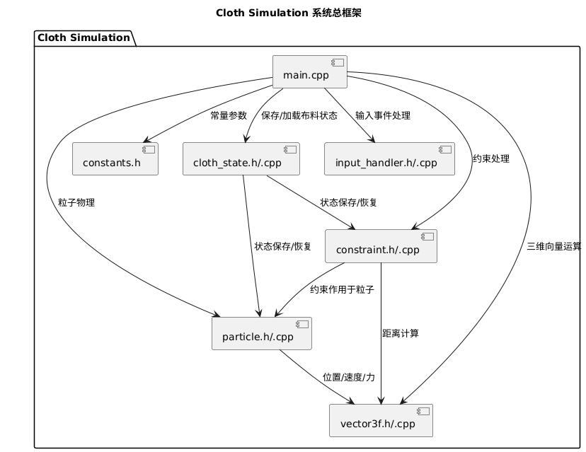

\begin{titlepage}
\begin{tikzpicture}[remember picture, overlay]
% 在右上角插入校徽
\node[anchor=north east, xshift=-2cm, yshift=-1cm] at (current page.north east) {
\includegraphics[width=7cm]{nuaa_logo.png}
};
\end{tikzpicture}
\centering
\vspace{3cm}

    \fontsize{40}{50}\selectfont
    \textbf{《面向对象程序设计语言》课程设计报告}\\[0.5cm]

    \fontsize{20}{30}\selectfont
    \textbf{基于粒子-约束模型的实时布料仿真与交互系统}\\[3cm]

    \begin{tabular}{rl}
        姓\hspace{1em}名： & 黄耘青 \\[0.5cm]
        学\hspace{1em}号： & 022330225 \\[0.5cm]
        班\hspace{1em}级： & 1623301 \\[4cm]
    \end{tabular}

    \vfill
    \fontsize{15}{25}\selectfont
    南京航空航天大学 \hspace{0.2em} 计算机科学与技术学院/软件学院

\end{titlepage}

\newpage

<style>
  ul {
    line-height: 1.2; /* 调整行间距 */
  }
</style>

\renewcommand{\contentsname}{目录}
\tableofcontents

\newpage

# 一、需求分析

布料模拟系统在现代技术应用中具有重要意义。无论是游戏领域中的角色服装动态效果，还是影视作品里旗帜飘扬的真实感，这些都需要布料模拟的支持。此外，在虚拟现实和工程仿真中，布料的力学特性分析可用于测试材料性能，提高设计和研究效率。因此，开发一个支持交互性和可调参数的布料模拟系统，能够为多个领域提供关键的支持。

从学术和研究的角度来看，布料物理模拟系统也是一个不可多得的学习与探索机会。通过实现布料模拟，可以掌握物理引擎中质点系统、力学计算以及约束解决等核心功能，为开发者深入理解数值模拟提供实践经验。同时，这种系统还可以作为研究的基础，进一步扩展为更复杂的三维布料模拟，或者整合到更大的工业物理引擎中。

采用 C++来开发布料模拟系统具备显著优势。首先，由于布料模拟中涉及大量的物理计算，特别是在处理大规模质点交互时，C++的高性能特性显得尤为重要。静态编译、高效执行以及对内存的手动管理能力使其能够充分优化计算密集型任务。此外，C++提供了优秀的硬件级控制能力，支持并行计算优化方案，满足复杂布料模拟对效率的严苛要求。

同时，C++出色的面向对象设计同样非常适合布料模拟的体系结构。例如，布料由质点、约束与整体力学构成，而 C++利用封装、继承和多态可以清晰地表达这些物理对象之间的关系，优化代码的可读性和可维护性。此外，C++支持跨平台开发，这使得模拟系统可以部署到不同操作系统上，方便推广和应用。

综合来看，布料模拟系统的开发既能满足实际应用需求，也能在学术和技术研究中提供宝贵的经验。而 C++凭借其高性能、灵活性和丰富的社区支持，成为了开发该系统的最佳选择。

# 二、系统设计

程序的主要功能可以分为以下几个方面：

1. 布料模拟

   - 使用粒子 (Particle) 和约束 (Constraint) 模型实现布料仿真，模拟布料的动态行为。
   - 提供布料重置功能，支持不同类型的网格结构，包括正方形 (Square)、三角形 (Triangle) 和六边形 (Hexagon)。
   - 粒子在仿真中受到重力、风力等物理作用力的影响，模拟逼真的布料动态。
   - 支持撕裂模式 (Tear Mode)，用户可以通过按键激活，手动撕裂布料的一部分。

2. 三维渲染

   - 使用 SFML 图形库进行三维渲染，显示布料模型及其动态视觉效果。
   - 包含功能完善的相机系统，支持相机位置、偏航 (Yaw)、俯仰 (Pitch) 和视角距离 (Camera Distance) 的控制。
   - 提供世界坐标转换至相机坐标 (World-to-Camera) 和相机坐标投影到二维屏幕 (Projection) 的功能，形成直观的三维视觉效果。
   - 渲染布料中的粒子和连接约束形成的网格，展现布料的整体形状和动态动作。

3. 用户交互

   - 相机控制：
     - 鼠标拖拽实现相机旋转（俯仰、偏航）。
     - 鼠标滚轮调整相机距离，用户可自由缩放视角远近。
     - 通过键盘（W/S/A/D/Q/E 键）实现相机视角平移，便于观察布料的特定区域。
   - 布料交互：
     - 通过鼠标左键拖拽布料粒子，操控局部布料的形态。
   - 参数调整：
     - 通过键盘调节风力，例如按 F 键切换风的开关，按 [ 和 ] 键调整风力大小。
     - 通过数字键 (1/2/3) 切换布料网格类型。
     - 按 R 键快速重置布料仿真状态，恢复初始布局。
     - 提供调整约束迭代次数、时间步长等物理仿真参数的功能，便于观察不同配置下的模拟效果。

4. 信息显示

   - 屏幕实时显示多种重要信息，包括 FPS（帧率）、当前粒子和约束数量等布料仿真数据。
   - 显示风力、重力、网格类型、模拟参数等当前状态信息，便于实时了解仿真的具体设置和运行情况。
   - 提供便捷的操作提示，帮助用户快速掌握所有按键和功能。

5. 状态管理与更新
   - 在主循环中实时处理用户输入事件，更新程序的物理状态，并进行画面的渲染。
   - 整个物理更新过程包括：
     - 施加重力和风力等外力，更新粒子的位置。
     - 通过多次迭代满足约束条件，确保布料的动态行为符合物理规律。
   - 持续监测与响应用户的交互操作，完成粒子拖拽、相机调整及参数变更。

通过这些功能，程序实现了一个完整的实时布料仿真与交互系统，不仅提供了逼真的布料动态效果，还允许用户自由调整仿真参数和观察不同的物理行为，以便进行探索或学习。

# 三、程序运行平台

本程序开发时使用 Cmake v4.0.2 在 MSVC 2022 下编译，使用 SFML 3.0.1 作为图形库。

在 Windows 11 24H2、Arch Linux 6.14.6 和 macOS 15.4 Sonoma 上均测试通过。

> 操作系统: Windows, Linux, macOS
> 架构: 编译目标通常是 x86-64
> 构建工具: CMake v4.0.2
> 编译器: 支持 C++20 的编译器。
> 图形: 支持 OpenGL 的显卡。
> 核心库: SFML 3.0.1。

# 四、 系统总框架图



# 五、 程序类的说明

## 主程序（main.cpp）

- 负责程序的初始化、主循环和事件处理。
- 管理相机、布料和约束系统。
- 处理用户输入，更新布料状态并渲染画面。
  类的声明

```cpp
class Main {
  public:
    void init();
    void update();
    void render();
};
```

## 相机类（camera.cpp/camera.h）

- 负责相机的控制，包括位置、偏航、俯仰和视角距离。
- 提供世界坐标转换至相机坐标和相机坐标投影到二维屏幕的功能。

### 相机类声明

```cpp
class Camera {
public:
    Camera(const Vector3f& position = Vector3f(0, 0, 0), float yaw = 0.0f, float pitch = 0.0f);
    // 将世界坐标点转换为相机坐标空间
    Vector3f world_to_camera(const Vector3f& world_point) const;

    // 将3D相机坐标点转换为2D屏幕点
    // 注意：这包括一个简单的透视效果和偏移
    sf::Vector2f project(const Vector3f& world_point) const;

    // 旋转相机
    void rotate(float delta_yaw, float delta_pitch);

    // 沿其向前向量移动相机
    void zoom(float amount);

    // 沿视平面移动相机（平移）
    void pan(float delta_x, float delta_y);

    // 获取器
    const Vector3f& get_position() const;
    float get_yaw() const;
    float get_pitch() const;

    void set_position(const Vector3f& position);

private:
    Vector3f position_;
    float yaw_; // 绕Y轴旋转
    float pitch_; // 绕X轴旋转

    // 获取相机的前向、右向和上向量（可能很有用）
    Vector3f get_forward_vector() const;
    Vector3f get_right_vector() const;
    Vector3f get_up_vector() const;
};
```

## 布料类（cloth.cpp/cloth.h）

- 负责布料的初始化、更新和渲染。
- 管理布料的粒子、约束和物理状态。
- 处理布料的撕裂、重置和网格类型切换。

### 布料类声明

```cpp
// 布料模拟类，封装粒子、约束及相关操作
class Cloth {
public:
    Cloth(int row, int col, float rest_distance, float width, float height, float depth = 1000.0f);
    void reset(); // 重置布料
    void update(float gravity, float wind, float time_step, int satisfy_iter); // 更新物理状态
    void draw(sf::RenderWindow& window); // 绘制布料

    // 交互操作
    void apply_drag(const Vector3f& pos); // 拖拽粒子
    void stop_drag(); // 停止拖拽
    void toggle_pin(const Vector3f& pos); // 固定/解固定粒子

    // 获取最近粒子（用于交互）
    Particle* get_nearest_particle(const Vector3f& pos, float radius = 30.0f);

    // 参数设置
    void set_wind(float w) { wind_strength = w; }
    void set_gravity(float g) { gravity = g; }

    // 只读访问（如需外部遍历）
    const std::vector<Particle>& get_particles() const { return particles; }
    const std::vector<Constraint>& get_constraints() const { return constraints; }

private:
    int row, col; // 行列数
    float rest_distance; // 粒子间距
    float width, height, depth; // 区域尺寸
    float wind_strength = 0.0f;
    float gravity = 10.0f;

    std::vector<Particle> particles;
    std::vector<Constraint> constraints;
    Particle* dragged_particle = nullptr;

    void init_particles(); // 初始化粒子
    void init_constraints(); // 初始化约束

    // 辅助：计算粒子初始位置偏移
    float get_x_offset() const;
    float get_y_offset() const;
    float get_z_offset() const;
};
```

## 约束类（constraint.cpp/constraint.h）

- 负责约束的初始化、更新和渲染。
- 管理约束的粒子、约束和物理状态。
- 处理约束的撕裂、重置和网格类型切换。

### 约束类声明

```cpp
class Constraint {
public:
    Particle* p1;
    Particle* p2;
    float initial_length;
    bool active;

    Constraint(Particle* p1, Particle* p2)
        : p1(p1)
        , p2(p2)
        , active(true)
    {
        initial_length = (p2->position - p1->position).length();
    }

    Constraint(Particle* p1, Particle* p2, float rest_length)
        : p1(p1)
        , p2(p2)
        , initial_length(rest_length)
        , active(true)
    {
        if (initial_length <= 0) {
            initial_length = (p2->position - p1->position).length();
            if (initial_length == 0)
                initial_length = std::numeric_limits<float>::epsilon();
        }
    }

    void satisfy()
    {
        if (!active)
            return;

        Vector3f delta = p2->position - p1->position;
        float current_length = delta.length();
        if (current_length == 0)
            return;
        float difference = (current_length - initial_length) / current_length;
        Vector3f correction = delta * 0.5f * difference;

        if (!p1->is_pinned)
            p1->position += correction;
        if (!p2->is_pinned)
            p2->position -= correction;
    }

    void deactivate()
    {
        active = false;
    }
};
```

## 粒子类（particle.cpp/particle.h）

- 负责粒子的初始化、更新和渲染。
- 管理粒子的位置、速度和物理状态。
- 处理粒子的删除、重置和网格类型切换。

### 粒子类声明

```cpp
class Particle {
public:
    Vector3f position;
    Vector3f previous_position;
    Vector3f acceleration;
    bool is_pinned;

    Particle(float x, float y, float z = 0, bool pinned = false);

    void apply_force(const Vector3f& force);

    void update(float time_step);

    void constrain_to_bounds(float width, float height, float depth = 1000.0f);
};
```

## 布料状态类（cloth_state.cpp/cloth_state.h）

- 负责布料状态的初始化、更新和渲染。
- 管理布料的粒子、约束和物理状态。
- 处理布料的撕裂、重置和网格类型切换。

## 输入处理类（input_handler.cpp/input_handler.h）

- 负责输入的处理，包括鼠标、键盘和触摸屏。

### 输入处理类声明

```cpp
class InputHandler {
public:
    static void handle_mouse_click(const sf::Event& event, std::vector<Particle>& particles,
        std::vector<Constraint>& constraints);

private:
    static float point_to_segment_distance(const Vector3f& p, const Vector3f& a, const Vector3f& b);

    static Constraint* find_nearest_constraint(const Vector3f& mouse_pos,
        const std::vector<Constraint>& constraints);

    static void tear_cloth(const Vector3f& mouse_pos, const std::vector<Particle>& particles,
        std::vector<Constraint>& constraints);
};
```

# 六、模块分析

## 相机投影模块

相机-投影模块实现了从世界坐标到相机坐标的转换，以及将三维相机坐标投影到二维屏幕上的功能。在这个模块中，`Camera::world_to_camera` 方法通过计算点相对于相机位置的偏移量，再应用相机的俯仰（pitch）和偏航（yaw）旋转矩阵，从而将世界坐标转换为相机坐标系中的点。具体而言，首先对输入点减去相机位置以获得相对坐标，然后依次应用绕 Y 轴和 X 轴的旋转来表示偏航和俯仰角的影响，最终输出点在相机坐标系下的表示。

`Camera::project` 方法依据相机坐标计算屏幕上的二维投影坐标。这种投影使用了简单的基于深度的比例缩放策略，即通过调整 Z 坐标的偏移量来模拟距离的视觉效果。最终的屏幕坐标通过添加偏移常数和平移参数完成，此设计能够在保持直观效果的同时简化计算。

相机控制的核心功能包括旋转、缩放和平移，通过 `rotate`、`zoom` 和 `pan` 方法实现。旋转方法允许通过调整俯仰与偏航角实现对视角的改变，并提供了控制俯仰角范围的潜在选项，以避免相机翻转。缩放功能基于沿相机的前向向量进行拉近或拉远操作，从而让用户能够改变与目标场景的距离。而平移功能根据右向向量和上向向量允许相机在水平与垂直方向上移动，带来了灵活的视角调整能力。

此外，这个模块提供了对相机方向的计算，包括前向向量、右向向量和上向向量，这些均通过相机的俯仰和偏航角进行计算。其中，前向向量表示相机的观察方向，而右向向量和上向向量则分别用于构建相机的本地坐标系。这些向量不仅用于平移操作，还能在需要计算相机的空间方向时扮演关键角色。

总体而言，该模块是整个布料模拟系统中不可或缺的一部分，它通过一系列线性代数操作实现了三维场景的渲染和灵活交互。模块设计的几何计算相对简洁高效，既满足了实际需求，又为程序的扩展和优化提供了良好的基础。

## 布料约束模块

布料约束模块是布料模拟系统的核心，用于实现粒子和约束的物理行为。通过粒子作为布料的基本单元以及约束确保布料连接的性能，模块处理力的作用、约束的满足，以及布料的结构和动态更新。

粒子 (`Particle`) 是布料的最小单位，表示布料网格上的单个节点。每个粒子具备位置、前一帧的位置、加速度和是否被固定（pinned）等属性。粒子的运动基于 Verlet 积分法，该方法通过当前的位置、上一个位置和加速度来更新粒子的位置，从而得到稳定且高效的运动模拟。粒子可以受到外力（如重力和风力）的作用，但如果粒子被固定，就不会进行位置更新。此外，粒子可以通过 `constrain_to_bounds` 方法限制在规定边界内，以避免出界。

约束 (`Constraint`) 是粒子之间的连接，用于维持布料的形状和结构。约束的初始化在布料类的 `init_constraints` 方法中完成，它主要处理粒子之间的相邻关系，例如横向和纵向的连接。每个约束包括两个粒子及其初始距离，`satisfy` 方法负责约束的核心功能，通过调整两粒子的位置使它们的距离接近设定值，从而保持布料的弹性和形状稳定性。

布料 (`Cloth`) 是这些粒子和约束的集合。布料初始化时会通过 `reset` 函数调用 `init_particles` 和 `init_constraints` 来设置粒子网络和它们的连接关系。重力、时间步长以及约束迭代次数等参数会在每次更新时影响布料的真实感。`update` 方法是布料动力学的核心，首先对所有粒子施加重力和风力，然后通过多个迭代步骤调整约束，确保布料中的连接结构得到满足。在渲染方面，粒子的颜色由高度控制，而约束的颜色由拉伸程度决定，提供了直观的视觉反馈。

交互功能包括粒子的选中、拖拽、固定与解固定等操作。当用户点击布料时，通过 `get_nearest_particle` 方法在给定半径范围内查找最近的粒子，并能够将此粒子固定或拖动到指定位置。布料的物理表现会根据用户交互动态变化，增强了程序的实时性和工具性。

总体而言，布料约束模块通过粒子和约束的协同工作，精确模拟了布料的弹性和受力行为。模块的强大功能适应了多场景布料交互和展示需求，是整个布料模拟系统中的逻辑核心。

## 图形界面模块

输入交换模块的核心功能是处理用户输入（键盘和鼠标事件）和实现与布料系统的实时交互，同时管理相机视角和物理力的动态调节。它通过接收用户的输入事件，比如鼠标单击、拖拽、键盘按键等，实时更新布料、粒子和约束的状态，带来了强大的交互能力。

### 相机更新与视角管理

- 模块以观察者视角进行布料显示，旨在提供 3D 布料的动态视角切换。
- 使用 `cam_yaw` 和 `cam_pitch` 表示绕 Y 轴与 X 轴的相机旋转。为了避免视角翻转导致的“万向节死锁”，俯仰角 (`cam_pitch`) 被限制在正负 `π/2` 的范围内。
- 相机在球面上模拟绕原点的轨道运动，结合了 `cam_distance` 来控制观察距离的前后缩放。
- 支持包括 WASD 键（旋转视角）及鼠标滚轮（缩放视角）在内的多种视角控制。
- `world_to_camera` 和 `project` 函数负责坐标变换——从世界坐标到视口（屏幕）的 2D 投影。透视投影带来了视觉深度感，同时实现了基本的摄影机裁剪。

### 输入处理与交互

- 对鼠标和键盘多种输入模式进行了详细处理，包括：
  - 左键点击：用于拖拽最近的粒子。通过查找与鼠标屏幕位置最近的 3D 粒子，能够将该粒子拖拽到鼠标指定的位置，为此使用了反投影机制。
  - 右键点击：实现粒子固定/解固定。固定的粒子不会受到重力或拖力影响，适合模拟布料边缘的夹持行为。
  - 中键点击：启动平移模式（当前功能被注释），允许用户平移整个场景。
  - 鼠标滚轮：调整相机距离，控制场景缩放。
  - 键盘按键：支持多种场景功能开关和调整，如切换网格类型（T、H、Q 键）、开/关撕裂模式（X 键）、调节重力大小（+/-键）、控制风力大小（[ ] 键）、保存/加载布料状态（Ctrl+S/L 键）。
- 模块通过布尔标识 (`tear_mode`、`wind_on` 等) 实现功能模式的开/关，为用户提供即时反馈。

### 布料重置与模式切换

- 提供了网格结构（正方形、三角形、六边形）切换功能。当切换网格类型时，调用 `reset_cloth` 重新生成粒子和约束，动态调整布料结构。
- 支持使用撕裂模式删除粒子相关的约束，为布料模拟撕裂效果提供接口。在撕裂模式下，用户点击的粒子会解除其所有的约束。
- 通过 `reset_cloth` 对布料系统整体重置，重建粒子和约束状态，适用于调试或初始化。

### 力的作用和物理更新

- 粒子在每帧调用时受到重力或风力的作用，它们的加速度实时更新。施加到粒子的力通过 `apply_force` 实现，而粒子位置基于 Verlet 积分进行更新，这种方法确保了模拟的稳定性。
- 鼠标拖拽的粒子会跟随鼠标的屏幕位置更新到新的世界坐标，为此，模块实现了屏幕坐标到世界坐标的反向投影计算。
- 模块通过满足约束迭代的方式更新布料的弹性形状，使得粒子之间保持连接的初始距离，从而确保布料的弹性和物理特性。

### 界面与信息展示

- 模块提供实时的用户界面信息显示，信息面板分为两部分：
  1. 右上角：展示粒子数、约束数、帧率（FPS）、撕裂模式、风力开关等信息。
  2. 右下角：显示用户操作说明（支持说明切换键）。
  3. 左下角（可选）：动态显示相机参数、网格模式、粒子与约束统计等。
- 支持多维度的网格参考线绘制，包括基于 XZ 平面、XY 平面和 YZ 平面的网格，改善了用户的空间感知能力。
- 提供对坐标轴的可视化绘制（X 为红、Y 为绿、Z 为蓝），同时实现了平滑加粗线段绘制，提升了交互视觉表现。

# 七、比较有特色的函数

## 1. `world_to_camera`

```cpp
Vector3f Camera::world_to_camera(const Vector3f& world_point) const
{
    // Translate point relative to camera position first
    Vector3f p = world_point - position_;

    // Apply rotations: first pitch (around X), then yaw (around Y)
    float cy = std::cos(yaw_);
    float sy = std::sin(yaw_);
    float cx = std::cos(pitch_);
    float sx = std::sin(pitch_);

    // Original coordinates relative to camera
    float x = p.x;
    float y = p.y;
    float z = p.z;

    // Rotate around Y (yaw)
    float x1 = cy * x + sy * z;
    float z1 = -sy * x + cy * z;

    // Rotate around X (pitch)
    float y2 = cx * y - sx * z1;
    float z2 = sx * y + cx * z1;

    return Vector3f(x1, y2, z2); // Return point in camera coordinates
}
```

实现了从 世界坐标系 (World Space) 到 相机坐标系 (Camera Space) 的转换。包括一个关键操作：先平移再旋转，既将世界坐标点平移到相机局部坐标系，再应用相机的旋转（以 yaw 和 pitch 定义的方向）确定在相机坐标系中的确切位置。

对于 3D 渲染来说，相机坐标系是观察与操作的核心。因为相机视角总是朝向特定方向，我们需要将看到的点在相机定义的右手坐标系中重新确定。

计算分为以下几个步骤：

1. 点相对于相机的位移矢量：`p = world_point - position_`。
2. 首先绕 Y 轴（水平旋转，`yaw_`）对点进行旋转。通过三角函数计算旋转后的新坐标（经典的三维旋转公式，避免直接使用矩阵乘法实现）。
3. 然后绕 X 轴旋转（垂直旋转，`pitch_`），更新点的高度和深度。

最终返回点在相机坐标系中的三维位置。

`world_to_camera` 是所有相机功能的基础，因为它连接了世界坐标和相机视点，我们无论需要相机投影、对物体进行操作，还是实现 FPS 相机控制，这都是必须的步骤。

## 2. `project`

```cpp
sf::Vector2f Camera::project(const Vector3f& world_point) const
{
    Vector3f cam_coords = world_to_camera(world_point);
    // Simple projection: Offset + scale Z slightly for depth illusion
    // Match the logic from the original project function
    float screen_x = cam_coords.x + 100.0f;
    float screen_y = cam_coords.y + 100.0f - cam_coords.z * 0.5f;
    return sf::Vector2f(screen_x, screen_y);
}
```

实现了从 相机坐标系 (Camera Space) 到 二维屏幕坐标系 (2D Screen Space) 的简单投影。通过粗略的投影公式，计算 3D 点在摄影机中的屏幕位置，又体现出一定的深度感（z 值的影响）。

投影背后遵循 透视投影 的概念。远离相机的点在屏幕上显得更小（深度影响），而相机前的点靠近屏幕中心。

实现逻辑：

1. 将点从世界坐标转换到相机坐标（调用 `world_to_camera`）。
2. 简单实现了水平和垂直的屏幕偏移，通过硬编码的 `100.0f` 值创建了 2D 平移的基准点。
3. 深度 (z 参数) 被用作缩放因子，体现距离远近带来的差异，使投影点具有一定透视效果。

```cpp
float screen_x = cam_coords.x + 100.0f;
float screen_y = cam_coords.y + 100.0f - cam_coords.z * 0.5f;
```

简单的投影函数是 3D 渲染基础。这里没有使用复杂的矩阵运算调整，而是通过简单的加减法模拟了带深度信息的 2D 投影。虽然精度有限，但非常高效。

---

### 3. `get_forward_vector`

```cpp
Vector3f Camera::get_forward_vector() const
{
    float cy = std::cos(yaw_);
    float sy = std::sin(yaw_);
    float cx = std::cos(pitch_);
    float sx = std::sin(pitch_);
    // Forward vector in world space (opposite direction camera is looking)
    // Check the coordinate system assumptions. If Z is depth, forward might be (sy*cx, -sx, cy*cx)
    return Vector3f(sy * cx, -sx, cy * cx).normalized();
}
```

返回相机的 朝前方向 (Forward Vector)，即相机镜头正在观察的方向。通过计算 yaw 和 pitch，构造 3D 空间中的方向向量。

通过简单的三角函数计算出方向向量的分量：

- yaw 控制水平的旋转，用 `cos(yaw)` 和 `sin(yaw)` 确定相机方向在 XZ 平面中的偏移。
- pitch 控制上下旋转，高度变化用 `sin(pitch)` 实现。

返回值是一个归一化的三维向量，方便位置计算（比如缩放或沿方向移动）。

```cpp
float cy = std::cos(yaw_);
float sy = std::sin(yaw_);
float cx = std::cos(pitch_);
float sx = std::sin(pitch_);
// Forward vector in world space
return Vector3f(sy * cx, -sx, cy * cx).normalized();
```

Forward Vector 是相机运动和渲染的核心之一：

- 渲染光线追踪时，用它来确定相机的视角方向。
- 在用户需要通过键盘或鼠标控制相机运动时，forward vector 确定镜头向前或向后的移动。

## 粒子拖拽的反向投影

在鼠标拖拽粒子时，通过逆向计算屏幕坐标（鼠标位置）映射回三维世界坐标。该功能使用二维屏幕坐标反推到相机坐标空间，再结合相机的旋转与位置，计算出实际的世界坐标。这种算法保证鼠标拖动时粒子可以保持自然的跟随。

```cpp
Vector3f Camera::unproject(const sf::Vector2i& screen_pos) const
{
    // Convert screen position to camera coordinates
    Vector3f cam_coords = world_to_camera(Vector3f(screen_pos.x, screen_pos.y, 0.0f));
    // Convert camera coordinates to world coordinates
    return cam_coords + position_;
}
```

\newpage

# 八、总结

## 代码行

以下是项目中各个源文件的行数统计：

| 文件名                     | 行数 |
| -------------------------- | ---- |
| src/camera.cpp             | 128  |
| src/camera.h               | 45   |
| src/cloth.cpp              | 171  |
| src/cloth.h                | 50   |
| src/cloth_state.cpp        | 61   |
| src/cloth_state.h          | 11   |
| src/constants.h            | 14   |
| src/constraint.h           | 60   |
| src/event_handler.cpp      | 246  |
| src/event_handler.h        | 63   |
| src/input_handler.h        | 67   |
| src/main.cpp               | 773  |
| src/particle.h             | 44   |
| src/renderer.cpp           | 369  |
| src/renderer.h             | 51   |
| src/simulation.h           | 21   |
| src/simulation_manager.cpp | 234  |
| src/simulation_manager.h   | 96   |
| src/vector3f.h             | 53   |

总行数: 2557 行

## 存在的不足与对策

### 1. 粒子拖拽的反向投影问题

**问题描述**： 在实现粒子拖拽时，通过鼠标触发的二维屏幕坐标映射回三维世界坐标。一开始，计算过程中由于缺乏对投影矩阵和屏幕坐标的深入理解，导致粒子跳转或漂移现象，尤其在视角发生旋转后，拖拽效果显得不自然。

**解决方案**： 通过明确屏幕空间与相机坐标空间的变换过程，遵循透视投影法则（`near plane` 中的投影与 `fov_factor`）。 增加限制条件，比如设置一个最小深度值来防止粒子投影到意外的屏幕后方。 调试过程中调整鼠标位置到世界坐标的计算过程，确保算法能正确应用当前的相机旋转及缩放状态。

### 2. 三维坐标投影的边界问题

**问题描述**： 某些粒子经过相机投影后位于屏幕范围外，尤其是当粒子在相机背面时，未对其进行合理处理，导致部分粒子突然跳出或消失。

**解决方案**： 对粒子投影后的深度值 `z` 进行检查，限制最小深度值为正数，例如 `z > 0.1f`，通过丢弃或剔除在视锥外的粒子来避免异常行为。增加对粒子的状态标记，在检测到无效投影时，不在屏幕上绘制该粒子，从而提升渲染稳定性。

## 编程体会

在实现布料模拟的过程中，我对三维空间中的投影与反投影加深了理解，这是整个项目最具挑战性的部分之一。三维世界坐标到屏幕二维坐标的转换，以及用户交互中屏幕坐标反推回世界坐标的过程，要求我们对透视投影矩阵和相机坐标系有深入了解。在实际编程中，我遇到过粒子拖拽不自然、投影位置跳跃等问题，通过系统地推导和调试方程，最终实现了对空间坐标的准确转换。这让我意识到，数学公式的严谨性和边界条件的考虑在三维编程中尤为重要。

交互设计是这次编程中另一个重要的部分。不论是粒子的拖拽固定，还是撕裂布料的功能，都需要用户操作反馈的实时性。在实现这些功能时，我发现，开发过程中程序员视角与用户视角存在着天然的差距。为了提高用户体验，我加入了实时粒子捕捉、固定状态的颜色高亮以及拖拽过程中动态平滑更新的逻辑。通过这样的改进，不仅提升了程序的易用性，也在反复测试中培养了对交互设计的敏感性。

这次编程实践是对物理引擎、图形渲染和交互设计的一次全面探索。从模型搭建到真实效果的调试，涉及到的细节无数，这对我的耐心和工程能力都是一次考验。更重要的是，它让我意识到，好的程序不仅仅是功能的简单实现，还需要在用户体验、稳定性和性能优化之间找到最佳平衡。这些收获为我后续开发复杂图形应用提供了宝贵的经验和信心。

## 后记

本报告所提及的源码和全部测试用例均可在我的 GitHub 仓库中查看，地址为 [github.com/4627488/cloth-simulator](https://github.com/4627488/cloth-simulator)。

本报告采用 CC BY-NC-SA 4.0 协议 { width=10% } 公开。
